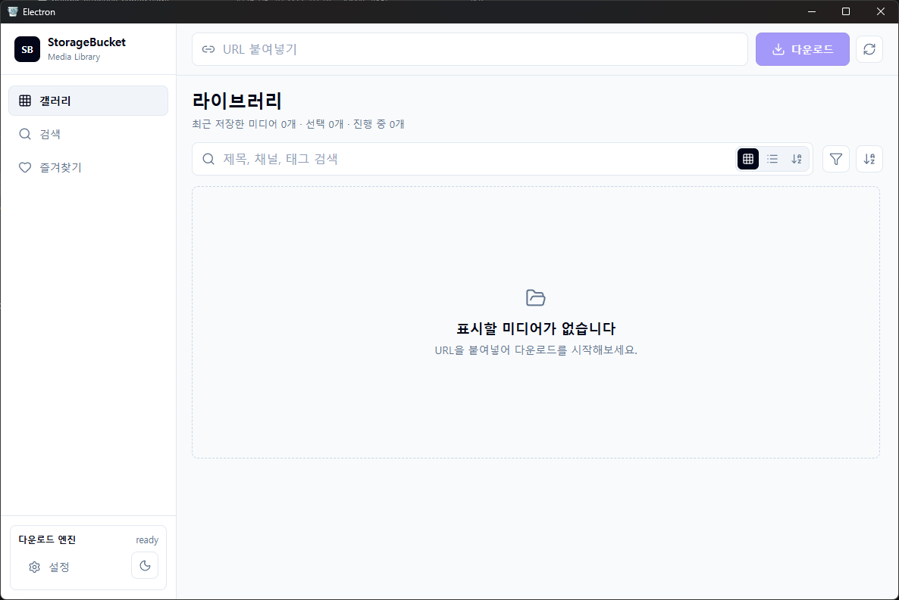

# StorageBucket

다양한 미디어를 한 곳에서 관리하기 위한 데스크톱 앱 프로젝트입니다.
 
 
# 1. StorageBucket 소개

StorageBucket은 사용자가 이용 권한을 가진 미디어를 한곳에서 정리하고 관리하기 위한 데스크톱 앱입니다.
다운로드 작업을 등록하고 다운로드가 완료된 미디어의 태그 또는 즐겨찾기 기능을 이용해 미디어를 관리할 수 있습니다.

 
 

## Language

- [**English**](./README.md)
- **한국어** (현재 페이지)

---

## 주요 기능

- URL 기반 미디어 다운로드 작업 등록 및 상태 관리
- 다운로드 기록, 썸네일, 메타데이터 로컬 저장
- yt-dlp, gallery-dl 등 외부 도구 연동
- 저장 경로 및 앱 설정 관리
- Electron IPC를 통한 main/renderer 프로세스 분리
- SQLite와 Drizzle ORM 기반 데이터 관리
 
 

## 예정된 계획
- 다운로드 큐 우선순위 및 일시정지/재개 기능
- 실패한 작업 재시도 및 상세 오류 로그 제공
- 다운로드 프리셋 및 포맷 선택 옵션 추가
- 대용량 라이브러리에서의 목록 렌더링 성능 개선
 
 

## 사용 책임

본 앱은 사용자가 권한을 가진 미디어를 개인적으로 저장하고 관리하기 위한 도구입니다.  
저작권법, 플랫폼 이용약관, 콘텐츠 라이선스를 준수하는 범위에서 사용해야 하며, DRM 우회나 무단 재배포를 목적으로 하지 않습니다.
 
 

## 라이선스

이 프로젝트는 MIT 라이선스를 따릅니다.